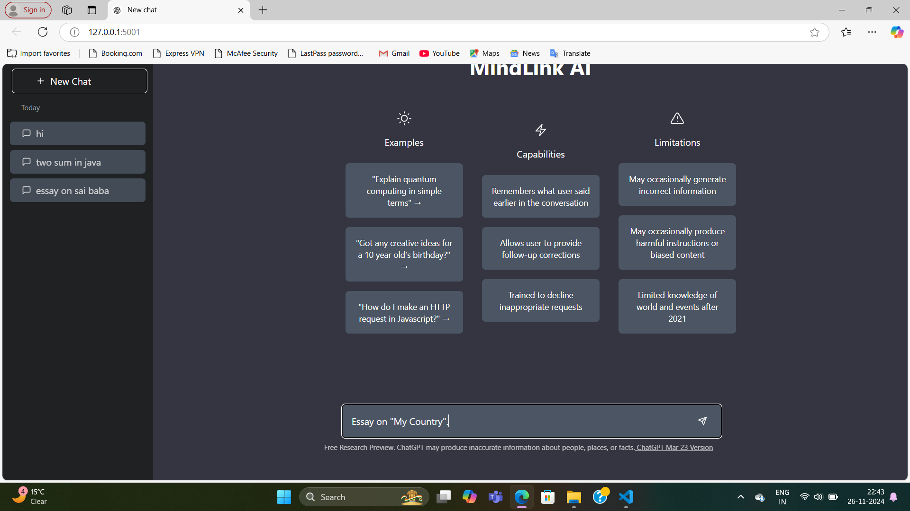
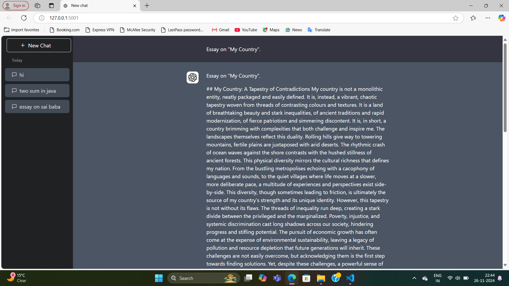

# MindLink AI 

MindLink AI is an intelligent conversational assistant built using OpenAI's GPT API. This project is designed with Flask as the backend framework, TailwindCSS for the modern frontend design, and MongoDB to store user interactions.

---

## Features

- **Conversational AI**: Interact with an AI assistant for queries and discussions.
- **User-Friendly Interface**: Clean and responsive design using TailwindCSS.
- **Session Storage**: Save and retrieve chat history using MongoDB.
- **Customizable Backend**: Flask-powered API for flexible and scalable deployment.
- **Dynamic Name**: Customized to MindLink AI, giving it a unique identity.

---

## Screenshots

### 1. **Homepage**


### 2. **Chat Interface**


### 3. **Chat History**


> **Note:** Add your screenshots in the `ss` folder and name them accordingly.

---

## Tech Stack

### Backend
- **Flask**: Lightweight and powerful web framework for Python.
- **OpenAI GPT API**: Powering the conversational intelligence.

### Frontend
- **HTML**: Base structure for the web application.
- **TailwindCSS**: Modern and utility-first CSS framework for styling.

### Database
- **MongoDB**: Stores user chat history and session data.

---

## Setup Guide

### Prerequisites
- Python 3.8+ installed.
- MongoDB installed or access to MongoDB Atlas.
- OpenAI API key.

### Steps to Run Locally
1. **Clone the Repository**
   ```bash
   git clone https://github.com/your-username/MindLink-AI.git
   cd MindLink-AI
